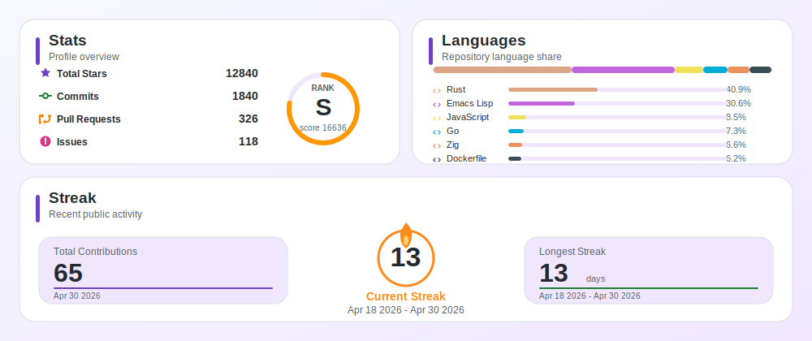
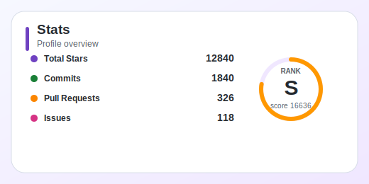
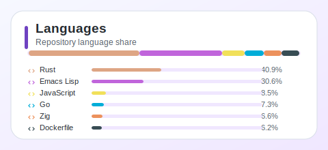
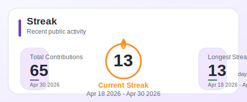

**Code is cheap, help out with your tokens!**

# GitHub Personal Stats

Generate a polished GitHub profile dashboard as one SVG. The renderer owns the layout, so your README does not have to fight tables, image heights, or fragile HTML alignment.

<p align="center">
  
</p>

## Why Use It

- One default dashboard for stats, language share, total contributions, current streak, and longest streak.
- Optional individual cards when you want a custom README layout.
- Release-binary GitHub Action, local CLI, and HTTP server deployment path.
- Fixed SVG dimensions with configurable width and height.
- Deterministic rendering backed by fixtures and snapshot tests.

## Card Examples

<p align="center">
  
  
</p>

<p align="center">
  
</p>

## Quick Start

Use the Action from your profile repository and commit the generated dashboard back to `profile/github-personal-stats.svg`.

```yaml
name: GitHub Personal Stats

on:
  workflow_dispatch:
  schedule:
    - cron: "0 0 * * *"

jobs:
  generate:
    runs-on: ubuntu-latest
    permissions:
      contents: write
    steps:
      - uses: actions/checkout@v5
      - uses: liuchong/github-personal-stats@v1.0.0
        with:
          card: dashboard
          path: profile/github-personal-stats.svg
          options: --user your-github-login --width 1000 --height 420
      - uses: stefanzweifel/git-auto-commit-action@v5
        with:
          commit_message: "chore: update profile stats"
```

Then add the generated image to your profile README:

```md

```

## Local Preview

Generate the showcase dashboard from the deterministic example data:

```sh
cargo run -p github-personal-stats -- generate \
  --fixture examples/showcase.json \
  --user showcase \
  --card dashboard \
  --output examples/dashboard.svg
```

Generate an individual card:

```sh
cargo run -p github-personal-stats -- generate \
  --fixture examples/showcase.json \
  --card languages \
  --width 520 \
  --height 260 \
  --output examples/languages.svg
```

## Documentation

- [User Guide](docs/user-guide.md): Action setup, CLI usage, card types, sizing, and README patterns.
- [Deployment Guide](deploy/README.md): HTTP server, container, and Kubernetes deployment notes.
- [Vercel Notes](deploy/vercel/README.md): lightweight serverless deployment considerations.

## Repository Layout

- `crates/core`: shared data model, aggregation, rendering, and configuration.
- `crates/cli`: command-line interface.
- `crates/server`: HTTP interface.
- `examples`: deterministic showcase data and generated SVG previews.
- `.agents`: durable AI development memory and process files.

## Development

```sh
cargo fmt --check
cargo clippy --all-targets -- -D warnings
cargo test
```

Coverage is enforced in CI with `cargo llvm-cov`.

## License

This project is licensed under 1PL. See [`LICENSE`](LICENSE).
