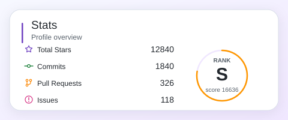
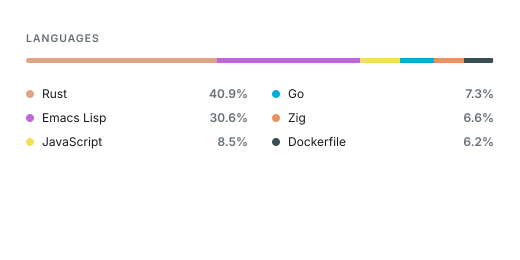
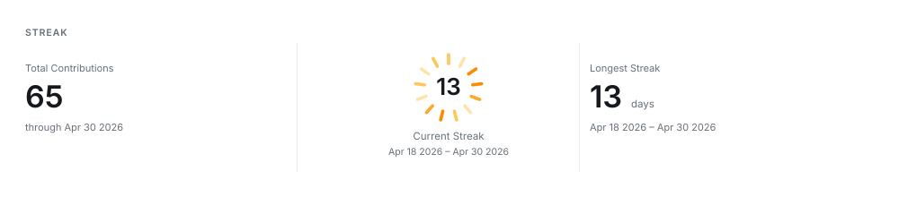
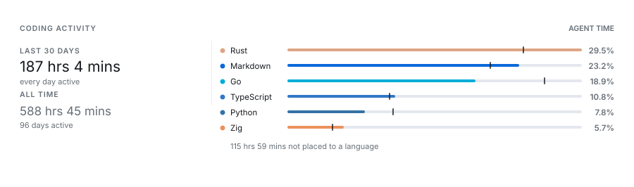

**Code is cheap, help out with your tokens!**

<p align="center">
  <picture>
    <source media="(prefers-color-scheme: dark)" srcset="./docs/brand/logo-dark.svg" />
    
  </picture>
</p>

Generate a polished GitHub profile dashboard as one SVG. The renderer owns the layout, so your README does not have to fight tables, image heights, or fragile HTML alignment.

<p align="center">
  
</p>

## Why Use It

- One default dashboard for stats, language share, total contributions, current streak, and longest streak.
- Optional individual cards when you want a custom README layout.
- A heat ring that shows each day of your streak, configurable down to its window, shape, scale, palette, and centre label.
- Panels that report what you choose: which stats rows, how many languages, and which figures sit beside the ring.
- Light, dark, and transparent themes, so a profile can follow the reader's colour scheme.
- Tiles that reflow on a phone: any single figure or the ring on its own, each fitted to its content, so a README row stacks at full size instead of shrinking.
- One fetch behind any number of tiles: read a profile once, then draw every card, theme, and width from what was saved.
- Coding activity read from your own machine: how long the work took, how much of it an agent wrote, and which models did — with no account anywhere and no service in the cloud.
- Release-binary GitHub Action, local CLI, and HTTP server deployment path.
- Fixed SVG dimensions with configurable width and height.
- Deterministic rendering backed by fixtures and snapshot tests.

## Card Examples

<p align="center">
  
  
</p>

<p align="center">
  
</p>

## Heat Ring

Each node on the ring is one day of your current streak, shaded by that day's contribution count, and the ring always covers exactly the days the centre reports. Long streaks switch from ticks to averaged bands so the ring stays readable.

<p align="center">
  
  
  
  
</p>

The window, day limit, shape, threshold, scale, palette, and centre label are all configurable. See [Heat Ring](docs/user-guide.md#heat-ring) for the options and what each one looks like.

## Themes

<p align="center">
  
  
</p>

`--theme light`, `dark`, or `transparent`. The heat ramp re-anchors on a dark card so busy days stay the brightest thing in the ring. Generate one card per surface and reference both through `<picture>` to follow the reader's colour scheme; see [Themes](docs/user-guide.md#themes).

## Coding Activity

Your profile knows what you pushed and nothing about how it came to be. A collector reads that from records your machine already keeps: hours worked, lines written, which models wrote them, and what they were billed.

<p align="center">
  <picture>
    <source media="(prefers-color-scheme: dark)" srcset="./docs/images/activity/card-dark.svg" />
    
  </picture>
</p>

The same record reads as text for a README made of words, and the card is the only one here that renders with no token, no saved profile, and no network:

```text
LINES BY LANGUAGE

Total        +119,979   lines, 99.94% by an agent

Rust          +35,995   #########################   30.00 %
Markdown      +28,134   ####################-----   23.44 %
Go            +21,941   ###############----------   18.28 %
```

Nothing leaves your machine unless you send it: the record holds counts and durations, never a path, a project, or a line of code. See [Coding Activity](docs/user-guide.md#coding-activity) for what each figure means and [Collecting Activity](docs/user-guide.md#collecting-activity) for the collector, the daemon, and the editor plugin.

## Quick Start

Use the Action from your profile repository and commit the generated dashboard back to `profile/github-personal-stats.svg`.

```yaml
name: GitHub Personal Stats

on:
  workflow_dispatch:
  schedule:
    - cron: "0 0 * * *"

jobs:
  generate:
    runs-on: ubuntu-latest
    permissions:
      contents: write
    steps:
      - uses: actions/checkout@v5
      - name: Check personal stats token
        env:
          PERSONAL_STATS_TOKEN: ${{ secrets.PERSONAL_STATS_TOKEN }}
        run: test -n "$PERSONAL_STATS_TOKEN"
      - uses: liuchong/github-personal-stats@v1.5.0
        with:
          card: dashboard
          path: profile/github-personal-stats.svg
          options: --user your-github-login --width 1000 --height 420 --authored-languages --author-email old@example.com,work@example.com --hide-language Ruby --min-repo-language-share 2
          token: ${{ secrets.PERSONAL_STATS_TOKEN }}
      - uses: stefanzweifel/git-auto-commit-action@v5
        with:
          commit_message: "chore: update profile stats"
```

Do not use the default `GITHUB_TOKEN` when you expect private repository data. It is scoped to the workflow repository and cannot read all private repositories owned by the profile user. Create a dedicated token instead:

- Classic token template: [create a token with `repo` selected](https://github.com/settings/tokens/new?description=GitHub%20Personal%20Stats&scopes=repo).
- Fine-grained token: create one at [Fine-grained personal access tokens](https://github.com/settings/personal-access-tokens/new), select the repositories you want counted, and grant read access to metadata and contents.

Save the token as a repository secret named `PERSONAL_STATS_TOKEN`.

Then add the generated image to your profile README:

```md

```

## Local Preview

Reading a profile is the slow part, and drawing from one costs nothing, so read it
once and draw as often as you like:

```sh
cargo run -p github-personal-stats -- fetch --user your-github-login --output profile.json
cargo run -p github-personal-stats -- generate --fixture profile.json --card stats --output stats.svg
cargo run -p github-personal-stats -- generate --fixture profile.json --card heat  --output heat.svg
```

Generate the showcase dashboard from the deterministic example data:

```sh
cargo run -p github-personal-stats -- generate \
  --fixture examples/showcase.json \
  --user showcase \
  --card dashboard \
  --output examples/dashboard.svg
```

Generate an individual card:

```sh
cargo run -p github-personal-stats -- generate \
  --fixture examples/showcase.json \
  --card languages \
  --width 520 \
  --height 260 \
  --output examples/languages.svg
```

Add `--authored-languages` when you want the language card to count only owned repositories where the target user has commit contributions. Add `--author-email` with comma-separated values, or repeat it, for historical commit emails that GitHub no longer associates with the user. The default language view still counts all owned non-fork repositories.

Add `--hide-language Ruby` when repository-level language data includes languages you do not want to display. The option accepts comma-separated values and can also be repeated.

Add `--min-repo-language-share 2` to ignore languages that make up less than 2% of an individual repository before the global language share is calculated.

## Documentation

- [Documentation site](https://liuchong.org/github-personal-stats/): the guide as a set of pages, with every card, ring, and palette shown.
- [User Guide](docs/user-guide.md): the same content in one file, readable on GitHub. The site is generated from it, so the two cannot disagree.
- [Deployment Guide](deploy/README.md): HTTP server, container, and Kubernetes deployment notes.
- [Vercel Notes](deploy/vercel/README.md): lightweight serverless deployment considerations.

## Repository Layout

- `crates/core`: shared data model, aggregation, rendering, and configuration.
- `crates/cli`: command-line interface.
- `crates/server`: HTTP interface.
- `crates/collect`: reads local coding activity and publishes a snapshot.
- `crates/daemon`: the resident collector, its local panel, and the endpoint plugins report to.
- `plugins/vscode`: the editor plugin, covering VS Code, Cursor, and VSCodium.
- `plugins/emacs`: the Emacs mode, which reports with or without the daemon running.
- `docs`: the guide, the illustrations, the brand marks, and the generated site.
- `examples`: deterministic showcase data and generated SVG previews.
- `.agents`: durable AI development memory and process files.

## Development

```sh
cargo fmt --check
cargo clippy --all-targets -- -D warnings
cargo test
```

Coverage is enforced in CI with `cargo llvm-cov`.

The site and the brand marks are generated, and both checked in, so GitHub Pages
has something to serve without a build step:

```sh
python3 docs/brand/build.py   # the icon and wordmark
python3 docs/build.py         # docs/index.html and docs/pages/
python3 docs/check.py         # every reference reachable from docs/
```

The illustrations are generated too, each from a fixture rather than from anybody's
real data, so every picture in the guide can be reproduced:

```sh
python3 scripts/render-ring-samples.py      # the heat ring's windows, shapes, scales, palettes
python3 scripts/render-panel-samples.py     # what each panel reports
python3 scripts/render-tile-samples.py      # the composable tiles
python3 scripts/render-activity-samples.py  # the activity card, and the chart blocks the guide quotes
```

## License

This project is licensed under 1PL. See [`LICENSE`](LICENSE).
