# User Guide

GitHub Personal Stats creates SVG assets for GitHub profile READMEs. The default output is a single dashboard image, and individual cards are available for custom layouts.

<p align="center">
  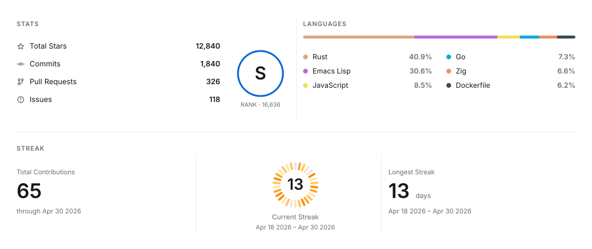
</p>

## Setup Overview

1. Add a workflow to your profile repository.
2. Generate one or more SVG files into a tracked directory such as `profile/`.
3. Commit those SVG files from the workflow.
4. Reference the generated SVG from your profile README.

## GitHub Action

Create `.github/workflows/github-personal-stats.yml`:

```yaml
name: GitHub Personal Stats

on:
  workflow_dispatch:
  schedule:
    - cron: "0 0 * * *"

jobs:
  generate:
    runs-on: ubuntu-latest
    permissions:
      contents: write
    steps:
      - uses: actions/checkout@v5
      - name: Check personal stats token
        env:
          PERSONAL_STATS_TOKEN: ${{ secrets.PERSONAL_STATS_TOKEN }}
        run: test -n "$PERSONAL_STATS_TOKEN"
      - uses: liuchong/github-personal-stats@v1.4.0
        with:
          card: dashboard
          path: profile/github-personal-stats.svg
          options: --user your-github-login --width 1000 --height 420 --authored-languages --author-email old@example.com,work@example.com --hide-language Ruby --min-repo-language-share 2
          token: ${{ secrets.PERSONAL_STATS_TOKEN }}
      - uses: stefanzweifel/git-auto-commit-action@v5
        with:
          commit_message: "chore: update profile stats"
```

## Private Repository Data

Use a dedicated personal access token when your dashboard should include private repositories. Do not rely on the default `GITHUB_TOKEN` for this purpose: it is scoped to the workflow repository and cannot read every private repository owned by the profile user.

Create one of these tokens:

- Classic PAT: use this template, then create the token with `repo` selected: <https://github.com/settings/tokens/new?description=GitHub%20Personal%20Stats&scopes=repo>
- Fine-grained PAT: use <https://github.com/settings/personal-access-tokens/new>, select the repositories you want counted, and grant read access to metadata and contents.

Save the token in your profile repository as an Actions secret:

```sh
gh secret set PERSONAL_STATS_TOKEN --repo your-login/your-login
```

The workflow should pass only that secret to the Action:

```yaml
token: ${{ secrets.PERSONAL_STATS_TOKEN }}
```

Add a check step before generation so a missing token fails the workflow instead of silently generating public-only data:

```yaml
- name: Check personal stats token
  env:
    PERSONAL_STATS_TOKEN: ${{ secrets.PERSONAL_STATS_TOKEN }}
  run: test -n "$PERSONAL_STATS_TOKEN"
```

Private token access affects repository language share, contribution totals, streaks, and any stats based on private repository metadata. If the token is missing or under-scoped, the dashboard can still render, but the data will be public-only or incomplete.

## Language Scope

By default, the language card counts all owned non-fork repositories. This matches repository language share, but it can include repositories owned by the profile user where most code was written by someone else.

Add `--authored-languages` to count only owned non-fork repositories where the target user has commit contributions:

```yaml
options: --user your-github-login --width 1000 --height 420 --authored-languages
```

If old commits used emails that GitHub no longer associates with the account, add those emails as supplements. The option accepts comma-separated values and can also be repeated:

```yaml
options: --user your-github-login --width 1000 --height 420 --authored-languages --author-email old@example.com,work@example.com
```

This mode still uses only GitHub API data. It does not clone or check out target repositories. The scope is repository-level: once a repository qualifies through GitHub contribution data, username commits, or a configured email match, its repository language sizes are counted. It does not perform per-line authorship analysis.

Hide languages that should not appear in the card:

```yaml
options: --user your-github-login --width 1000 --height 420 --authored-languages --hide-language Ruby
```

`--hide-language` accepts comma-separated values and can also be repeated.

Filter small per-repository language noise without hiding the language everywhere:

```yaml
options: --user your-github-login --width 1000 --height 420 --authored-languages --min-repo-language-share 2
```

`--min-repo-language-share 2` ignores a language in a repository when that language is less than 2% of that repository's language total. If another repository is actually Python-heavy, Python still counts there.

## Themes

`--theme` picks the palette: `light` (default), `dark`, or `transparent`. An unrecognised name fails the run rather than quietly rendering the default.

```yaml
options: --user your-github-login --theme dark
```

`transparent` drops the background but keeps the dark text of the light palette, so it belongs on a light surface. For a dark surface use `dark`.

### Following the reader's colour scheme

GitHub honours `<picture>` in a README, so generate one card per surface and let the browser choose. Add a second generate step:

```yaml
      - uses: liuchong/github-personal-stats@v1.4.0
        with:
          card: dashboard
          path: profile/github-personal-stats.svg
          options: --user your-github-login --theme light
          token: ${{ secrets.PERSONAL_STATS_TOKEN }}
      - uses: liuchong/github-personal-stats@v1.4.0
        with:
          card: dashboard
          path: profile/github-personal-stats-dark.svg
          options: --user your-github-login --theme dark
          token: ${{ secrets.PERSONAL_STATS_TOKEN }}
```

Then reference both, keeping the light file as the fallback for clients that ignore the media query:

```html
<picture>
  <source media="(prefers-color-scheme: dark)" srcset="./profile/github-personal-stats-dark.svg" />
  
</picture>
```

Colour scheme queries inside the SVG are not a substitute. GitHub serves the file as an image through its own proxy, so a single self-switching SVG cannot be relied on; two files and `<picture>` is the supported path.

### What the dark palette changes

A heat ramp encodes intensity as distance from the background, so the same stops cannot serve both surfaces. On a light card the quiet end is pale and recedes; on a dark card that same pale stop is the brightest thing in the ring, which makes a one-commit day outshout a fifty-commit day. The built-in palettes and single-colour ramps therefore turn around on `dark`: the quiet end sinks to just above the ring track and the busy end climbs.

| `--theme light` | `--theme dark` | `dark` with light stops forced |
| --- | --- | --- |
|  | 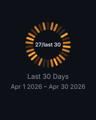 | 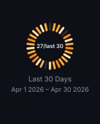 |
| Quiet days recede, busy days read orange | Quiet days recede into the surface, busy days glow | The quiet majority dominates and the ring reads inside out |

Four explicit stops are always taken exactly as given, on every theme, which is how the third example above is produced. If you spell out stops and also want dark support, spell out a second set for the dark card.

## Panel Content

Each panel decides what it reports. The defaults are what the card has always shown, so none of this needs configuring.

### Stats rows

Six figures are collected, and all six already feed the rank score. Four are listed by default; `--stat-rows` chooses which ones appear and in what order.

| Name | Row |
| --- | --- |
| `stars` | Total Stars |
| `commits` | Commits |
| `prs` | Pull Requests |
| `issues` | Issues |
| `reviews` | Reviews |
| `repos` | Contributed To |

| default | `--stat-rows stars,commits,prs,issues,reviews,repos` | `--stat-rows reviews,repos` |
| --- | --- | --- |
| 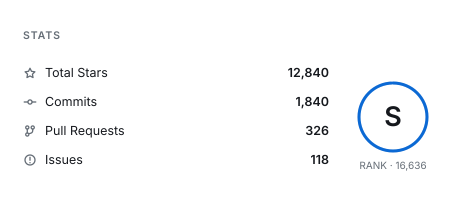 | 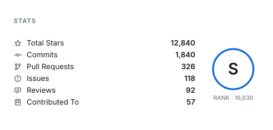 | 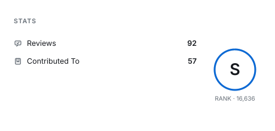 |
| Stars, commits, pull requests, issues | Reviews and repositories contributed to as well | A short list spreads out |

Rows share the height the panel has, so a longer list sits closer together, down to a floor that keeps two rows from touching. A list must name at least one row and cannot name the same row twice.

### Language rows

`--language-rows` sets how many languages the panel lists, from 1 to 8, defaulting to 6. The dashboard splits them across two columns.

| default | `--language-rows 3` |
| --- | --- |
| 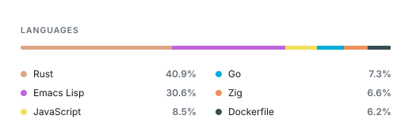 | 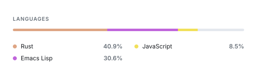 |

The bar above the list covers the languages the list shows, so when a profile has more languages than the panel lists, the remainder stays as visible track rather than being folded into the last segment.

### Streak panels

The panels either side of the ring each report one figure with the dates that figure covers. `--streak-sides` names the left and right one.

| Name | Panel |
| --- | --- |
| `total` | Total contributions, all years |
| `longest` | Longest streak, with its range |
| `current` | Current streak, with its range |
| `active` | Days with at least one contribution |

| default | `--heat-window 30 --streak-sides active,current` |
| --- | --- |
| 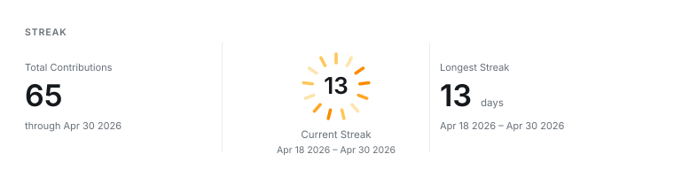 | 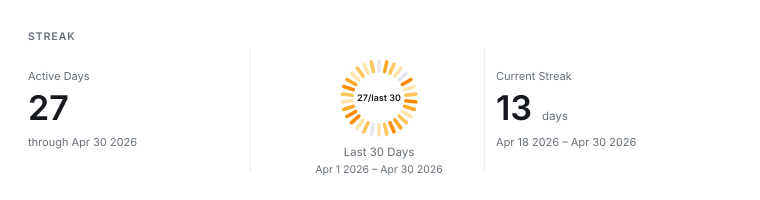 |

`current` is worth putting in a panel when the ring is not already reporting it, which is the case for a fixed window: the ring then covers the last N days while the panel keeps the streak itself. On the default streak window the ring centre is already the current streak, so a `current` panel repeats it.

A panel cannot be left empty and the two panels cannot report the same figure. Regenerate the images in this section with `python3 scripts/render-panel-samples.py` after building the CLI.

## Heat Ring

The dashboard and streak cards draw the current streak as a ring, where each node is one day and its depth is that day's contribution count. The ring covers exactly the days the number in its centre reports, so the two never disagree.

Everything below is optional. The defaults need no configuration.

### Window

The window decides how many days the ring covers. `streak` follows the current streak, so every node is an active day. A fixed window covers a set number of days ending on the latest one, including quiet days.

| `--heat-window streak` (default) | `--heat-window 30` | `--heat-limit 30` |
| --- | --- | --- |
|  |  | 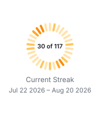 |
| 117 active days, one node each | 30 days, quiet ones in grey | The last 30 days of a 117 day streak |

A streak is uncapped by default. `--heat-limit` caps how many days the ring draws without changing the streak itself, which is useful once a streak grows past the point where the ring stays informative. The date line under the ring always describes what the ring covers, not the whole streak.

### Centre label

Three counts are available, and a template places them:

| Placeholder | Meaning |
| --- | --- |
| `{X}` | Days inside the window with at least one contribution |
| `{Y}` | Days the window covers, which is the number of nodes on the ring |
| `{Z}` | The current streak in full, before any limit shortens the ring |

The default template depends on the window: `{Y}` for a streak, where all three counts are the same number, and `{X}/last {Y}` for a fixed window.

| default, streak | default, fixed | `--heat-label "{X}/{Y}/{Z}"` | `--heat-label "{X} of {Y} → {Z}"` |
| --- | --- | --- | --- |
|  | 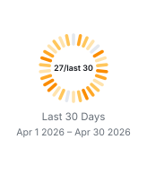 | 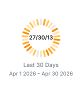 | 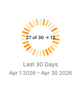 |

A template is free text, so any separator works. Longer text is set at a smaller size to stay inside the ring; keep templates short if you want the count to stay prominent.

### Shape

Radial ticks read well while they stay separable. Past roughly a hundred days they overlap into a furred edge, so the ring switches to arcs and averages neighbouring days into bands wide enough to see. `segmented` does this automatically and is the default.

| `--heat-shape ticks`, 30 days | `ticks`, 117 days | `arcs`, 117 days | `bands`, 117 days |
| --- | --- | --- | --- |
|  | 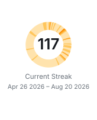 | 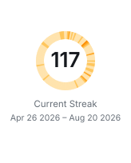 |  |
| Clean and countable | Crowded | One arc per day, under two pixels each | Days averaged into readable bands |

| Value | Behaviour |
| --- | --- |
| `segmented` | Ticks up to the threshold, averaged bands beyond it (default) |
| `ticks` | Always one radial tick per day |
| `arcs` | Always one arc per day, however thin |
| `bands` | Always averaged arcs |

`--heat-threshold` moves where `segmented` switches over. It defaults to 100 days; `--heat-threshold 87` switches at 87 instead.

### Scale

The scale maps a day's contribution count onto the four colour stops. Contribution counts are usually heavy-tailed — many ordinary days and a few large ones — and each scale handles that tail differently.

| `--heat-scale linear` (default) | `sqrt` | `log` | `quantile` |
| --- | --- | --- | --- |
| 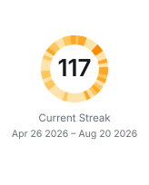 | 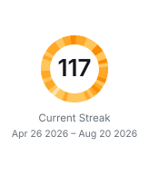 | 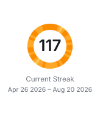 | 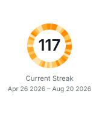 |
| Faithful to the raw counts, so a few big days dominate and ordinary days stay pale | Keeps ordinary days visible while big days still stand out | Compresses hard, so almost everything reads as busy | Splits the window into four equal shares, giving the most contrast and the least relation to raw counts |

Pick `linear` when you want the ring to be literal about volume. Pick `sqrt` when your busiest days are many times larger than your typical ones and the ring looks washed out.

### Colour

`heat-orange` is the default. Six palettes are built in:

| `heat-orange` | `github-blue` | `forest` | `violet` | `crimson` | `graphite` |
| --- | --- | --- | --- | --- | --- |
| 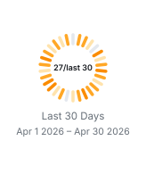 | 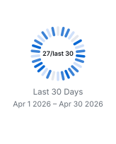 | 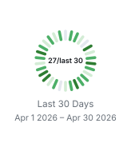 | 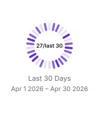 | 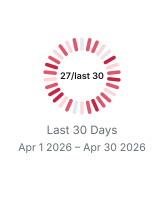 | 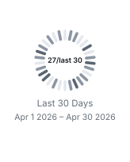 |

`--heat-color` also takes colours directly. One hex value becomes the busiest stop and the other three are derived from it in OkLab, which keeps the hue instead of fading towards grey; on a dark card the derivation runs the other way, as described under [Themes](#what-the-dark-palette-changes). Four hex values, quietest first, are used exactly as given on every theme.

| `--heat-color "#8250df"` | `--heat-color "#dbe9d5,#a3cf9a,#5aa04f,#1f6f2f"` |
| --- | --- |
| 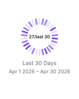 | 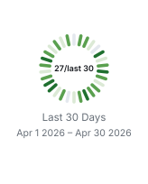 |

### Option reference

| Option | Default | Accepts |
| --- | --- | --- |
| `--heat-window` | `streak` | `streak` or a day count |
| `--heat-limit` | none | a day count, or `none` |
| `--heat-shape` | `segmented` | `segmented`, `ticks`, `arcs`, `bands` |
| `--heat-threshold` | `100` | a day count |
| `--heat-scale` | `linear` | `linear`, `sqrt`, `log`, `quantile` |
| `--heat-color` | `heat-orange` | a palette name, one hex value, or four hex values |
| `--heat-label` | per window | free text with `{X}`, `{Y}`, `{Z}` |

Pass them through the Action the same way as any other option:

```yaml
options: --user your-github-login --heat-window 60 --heat-scale sqrt --heat-color github-blue --heat-label "{X}/last {Y}"
```

### Behaviour worth knowing

- Above the threshold, neighbouring days are averaged so each band stays at least four pixels wide. The ring still spans exactly the days the centre reports, but the bands you can count are fewer than the days.
- A streak window has no quiet days by definition. Only a fixed window shows grey nodes.
- A window longer than the available history pads the missing days as quiet.
- When the streak is zero the ring falls back to a plain track and the centre reads `0`.
- Regenerate the images in this section with `python3 scripts/render-ring-samples.py` after building the CLI.

## README Usage

Reference the generated dashboard:

```md

```

For a richer profile section:

```md
<p align="center">
  
</p>
```

To follow the reader's colour scheme, generate a dark card too and reference both through `<picture>`, as described under [Themes](#following-the-readers-colour-scheme).

## Composing Tiles

One wide dashboard has to shrink to fit a phone. GitHub renders a README at about
846px on a desktop and about 308px on a phone, so a 1000px card arrives on a phone
at roughly a third of its size, taking 12.5px body text down to under 4px. A card
cannot re-lay-out on its own either: GitHub strips `style` and CSS, so nothing in
the page can react to the column it lands in.

Several smaller cards can, though. Images with fixed pixel widths sit side by side
while they fit and wrap when they do not, at their own size either way. Three
275px tiles occupy 825px of the desktop column and stack into three rows on a
phone, both at 1:1, so the text is the same size in both places.

### One fetch, many tiles

Rendering never asks GitHub anything: a card is drawn from a profile that has
already been read. Reading a profile, on the other hand, is the expensive part,
and `--authored-languages` makes it far more so, because attributing a language
by who wrote it costs a request per repository per address. A set of tiles that
fetches once per tile pays that bill once per tile and can exhaust an hourly API
allowance partway through.

`fetch` reads a profile once and saves it; `--fixture` draws from what was saved:

```sh
cargo run -p github-personal-stats -- fetch \
  --user your-github-login \
  --authored-languages \
  --output profile.json

cargo run -p github-personal-stats -- generate --fixture profile.json --card stats --output stats.svg
cargo run -p github-personal-stats -- generate --fixture profile.json --card heat  --output heat.svg
```

For one profile of 194 repositories, the fetch took seven minutes and the fourteen
tiles drawn from it took a third of a second altogether.

A saved profile holds the answers to the options that shape a fetch, so those
belong to `fetch`: `--authored-languages`, `--author-email`, and
`--min-repo-language-share`. Passing one of them to `generate --fixture` is
refused rather than quietly ignored. Everything about how a card is drawn, and
`--hide-language`, still applies at render time, so one saved profile serves any
number of themes, widths, and cards.

In a workflow, that is one `fetch` step ahead of the render steps:

```yaml
- uses: liuchong/github-personal-stats@v1.4.0
  with:
    mode: fetch
    path: ${{ runner.temp }}/profile.json
    options: --user ${{ github.repository_owner }} --authored-languages
    token: ${{ secrets.PERSONAL_STATS_TOKEN }}

- uses: liuchong/github-personal-stats@v1.4.0
  with:
    card: stats
    path: profile/stats.svg
    options: --fixture ${{ runner.temp }}/profile.json --width 275 --height auto
```

The render steps need no token, because they reach nothing.

### Tile sizes worth knowing

| Container | Measured width | Fits at 275px |
| --- | --- | --- |
| Desktop README | ~846px | 3 per row |
| Phone README (390px viewport) | ~308px | 1 per row |

### Fitting a card to its content

`--height auto` sizes a card to what it draws, so a tile carries no dead space
and needs no guessing:

```sh
cargo run -p github-personal-stats -- generate \
  --user your-github-login \
  --card stats \
  --width 275 \
  --height auto \
  --output profile/tiles/stats.svg
```

The `dashboard` and `status` cards divide a height between sections rather than
having one of their own, so they need an explicit height; asking them for `auto`
is refused rather than quietly ignored.

### The activity card

Every other card is drawn from your GitHub profile. This one is drawn from the
activity you collected locally, so it needs `--activity-record` pointing at the
same place `chart` reads, and refuses rather than drawing an empty card without
it:

```sh
cargo run -p github-personal-stats -- generate \
  --user your-github-login \
  --card activity \
  --activity-record ~/.local/state/github-personal-stats/storage/snapshots \
  --width 900 --height auto \
  --output profile/activity.svg
```

It takes the same `--activity-measure`, `--activity-windows` and `--hide-language`
as `chart`, and shows one measure over two spans: a bar per language for the
recent one, with a mark across each bar for where the longer span put it.

The shares are shares of the time a language could be put to, which on a record
with terminal agents in it is well short of the time measured — a source that
never says what was being worked on leaves its hours with no language to be a
share of. The card declares that remainder in a line beneath the bars, in the same
words and to the same arithmetic as `chart`, so putting the two side by side gives
one number per language rather than two.

### Splitting the streak card

At a tile width the streak card gives the ring a full-width row and sits its two
figures underneath, because three columns leave each figure about 90px:

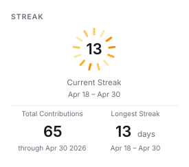

Its parts are also available on their own, which lets a README place them
wherever it likes. `heat` draws the ring, and `metric` draws a single figure:

<p>
  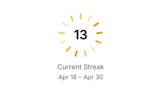
  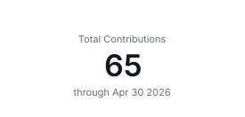
  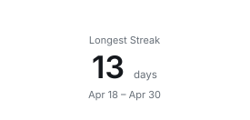
</p>

`--metric` accepts any name the panel lists accept, so the same vocabulary covers
tiles: `stars`, `commits`, `prs`, `issues`, `reviews`, `repos`, `total`,
`longest`, `current`, and `active`.

```sh
cargo run -p github-personal-stats -- generate \
  --user your-github-login \
  --card metric --metric stars \
  --width 275 --height auto \
  --output profile/tiles/stars.svg
```

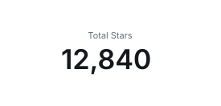

### Lining tiles up

Padding scales with card width by default, which suits a card seen on its own but
leaves the content edges of different widths out of line. Pin it when mixing
widths in one block:

```sh
--padding 20
```

### Display size and layout size

Because the cards are vector, the size a card is laid out at and the size it
arrives at are separable. `--scale` multiplies only the latter, so a tile can be
laid out for a narrow column and still be displayed larger:

```sh
--scale 1.5
```

### A row that reflows

Give each tile an explicit `width` so GitHub keeps it at its own size:

```md
<p>
  
  
  
</p>
```

<p>
  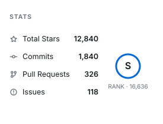
  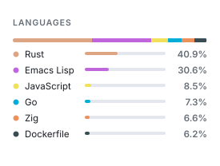
  
</p>

Keep the widths in a row adding up to no more than about 825px, or a tile drops
to the next row and leaves a gap beside the ones above it.

### Handing a phone a different drawing

A row of two cannot fill a desktop column and stay under 308px at the same time,
so two rows of unequal width are the usual outcome. What CSS cannot do here,
`<picture>` can: the `media` attribute on a `<source>` takes any media query, not
only `prefers-color-scheme`, and the browser is the one evaluating it. Drawing a
panel at both widths lets each column have the one it can show unscaled:

```md
<picture>
  <source media="(max-width: 768px) and (prefers-color-scheme: dark)" srcset="./profile/stats-narrow-dark.svg" />
  <source media="(max-width: 768px)" srcset="./profile/stats-narrow-light.svg" />
  <source media="(prefers-color-scheme: dark)" srcset="./profile/stats-dark.svg" />
  
</picture>
```

Leave the `width` attribute off here. It would apply to whichever drawing was
chosen and stretch the narrow one; without it each drawing arrives at its own
size. Because both come from one saved profile, the second width costs a render
rather than a fetch.

Combine this with `<picture>` from [Themes](#following-the-readers-colour-scheme)
to follow the reader's colour scheme as well. Regenerate the images in this
section with `python3 scripts/render-tile-samples.py` after building the CLI.

## Card Types

| Card | Output |
| --- | --- |
| `dashboard` | Combined profile dashboard |
| `stats` | Stats and rank card |
| `languages` | Repository language share |
| `streak` | Total contributions, current streak, longest streak |
| `heat` | The contribution heat ring on its own |
| `metric` | A single figure, chosen with `--metric` |
| `activity` | Coding activity card |
| `status` | Service status card |

The aliases `top-langs`, `top-languages`, and `coding-activity` are accepted by the CLI parser.

## Command Line

`github-personal-stats help` lists every command and option with its default. `--help` and `-h` work in the same place, including after a command, so `generate --help` prints the same page without rendering anything. The Action takes these same options through its `options` input.

## Sizing

The default dashboard size is `1000x420`.

```sh
cargo run -p github-personal-stats -- generate \
  --user your-github-login \
  --card dashboard \
  --authored-languages \
  --author-email old@example.com,work@example.com \
  --hide-language Ruby \
  --min-repo-language-share 2 \
  --width 1000 \
  --height 420 \
  --output profile/github-personal-stats.svg
```

For a local live preview, export a token with the same permissions:

```sh
GITHUB_TOKEN=YOUR_PERSONAL_STATS_TOKEN cargo run -p github-personal-stats -- generate \
  --user your-github-login \
  --card dashboard \
  --output profile/github-personal-stats.svg
```

Individual cards can use smaller dimensions:

```sh
cargo run -p github-personal-stats -- generate \
  --user your-github-login \
  --card languages \
  --width 520 \
  --height 260 \
  --output profile/languages.svg
```

Cards below 440px wide switch to layouts meant for a narrow column, and
`--height auto` removes the need to pick a height at all. See
[Composing Tiles](#composing-tiles) for building a row that reflows on a phone.

## Local Preview

The repository includes deterministic showcase data so you can preview changes without network access:

```sh
cargo run -p github-personal-stats -- generate \
  --fixture examples/showcase.json \
  --user showcase \
  --card dashboard \
  --output examples/dashboard.svg
```

Preview individual cards:

```sh
cargo run -p github-personal-stats -- generate --fixture examples/showcase.json --user showcase --card stats --width 520 --height 260 --output examples/stats.svg
cargo run -p github-personal-stats -- generate --fixture examples/showcase.json --user showcase --card languages --width 520 --height 260 --output examples/languages.svg
cargo run -p github-personal-stats -- generate --fixture examples/showcase.json --user showcase --card streak --width 1000 --height 220 --output examples/streak.svg
```

`examples/showcase.json` covers 30 days with a few quiet ones, which is what a fixed window needs to show. `examples/streak-117.json` carries a 117 day streak, which is where the ring changes geometry:

```sh
cargo run -p github-personal-stats -- generate --fixture examples/streak-117.json --card streak --width 1000 --height 220 --output /tmp/long-streak.svg
```

## Coding Activity Section

Update a marked README section:

```md
<!--START_SECTION:activity-->
<!--END_SECTION:activity-->
```

Run:

```sh
cargo run -p github-personal-stats -- update-readme --section activity --target README.md
```

Print the same chart to a terminal instead, which is the quickest way to try a configuration:

```sh
cargo run -p github-personal-stats -- chart --activity-record <your record>
```

With nothing configured you get what was written, who wrote it, and what wrote it:

```txt
LINES BY LANGUAGE

Total        +451,076   lines, 99.93% by an agent

Markdown     +118,648   #########################   26.30 %
Go            +91,139   ###################------   20.20 %
Rust          +85,184   ##################-------   18.88 %

LINES BY AUTHOR

Total          +451,076   lines, last 30 days

agent          +450,768   #########################   99.93 %
unattributed       +308   -------------------------    0.06 %

LINES BY MODEL

Total            +450,768   lines, 99.93% by an agent

gpt-5.6-sol      +126,001   #########################   27.95 %
claude-opus-5    +124,986   #########################   27.72 %
gpt-5.5          +109,683   ######################---   24.33 %

# agent    = unattributed    - rest
```

### What the figures mean

Three different things can be counted, they are measured by different means, and they are not interchangeable. Which one a chart leads with is worth choosing deliberately.

| Value | What it counts | Knows the language | Knows who wrote it |
| --- | --- | --- | --- |
| `lines` | Lines the editor watched appear | Yes | Yes |
| `time` | Wall clock while an agent was working | Partly | Yes |
| `tokens` | Tokens the agents were billed for | No | No |

`lines` is the default because a line is counted rather than inferred. The editor records a row per line as it appears, which is why it can say what language the line was in and which model produced it.

It is also why the figures are additions only, written `+451,076` with nothing after them. A line that was deleted stops having a row, so there is nothing left to count and no removal can be reported. That absence is what the source can see rather than a gap waiting to be filled, and reporting removals honestly would mean watching each edit as it happens, which is the editor plugin's job.

`unattributed` means what it says and no more: no request accounts for these lines. It is not a count of what you typed, and it deliberately does not claim to be. A formatter reformatting a file, a shell command writing one, a terminal agent editing outside the editor and a person typing all land here identically, because the editor recorded that the lines appeared and nothing recorded what produced them. Only a plugin watching each edit as it happens can honestly say a person typed something.

For the same reason, moments where unattributed lines appear across more than a handful of files at once are left out of the count altogether. An edit happens to a file; lines turning up in a hundred files inside one second is the tracker taking inventory of a workspace it has just been pointed at, or a formatter sweeping a tree. Those lines were on disk long before that second, so counting them would credit a month with work done over years, and attribute it to nobody in particular. On this record the distinction is not marginal: the largest sweep put 47,804 lines across 135 files in a single second, while no other unattributed moment reached beyond four files and no generated edit reached beyond fourteen. Left in, it would have reported 9.75% of a month as not written by an agent, and made one language look a third hand-written.

### How time is measured

Time is the weakest of the figures and the one worth understanding before quoting it.

There is no clock running. What exists is a set of moments — instants at which something was observed happening — and time is the space between consecutive moments, counted when the gap is shorter than the idle timeout (five minutes by default, `--idle-timeout`). A gap longer than that ends the stretch and is not counted at all. So the figure is only as good as how densely those moments were observed.

Every source's moments go into **one** timeline before any of this is counted, rather than each source being totalled on its own and the totals added. An afternoon in which an agent worked in your editor while another ran in a terminal is one afternoon, and summing per source would bill it twice.

Reading the terminal agents is what makes the figure defensible. Measured over one month of a real record:

| | Minutes with observed activity |
| --- | --- |
| Editor only | 8,214 |
| Terminal agents only | 13,150 |
| Together | 21,364 |

More work happened outside the editor's view than inside it. That changes not just the total but its quality — how much of the figure is observation and how much is filling in silence:

| Counted seconds coming from gaps of | Share |
| --- | --- |
| Under 30 seconds | 79% |
| 30 seconds to 2 minutes | 9% |
| 2 to 5 minutes | 12% |

With the editor alone, over half the total came from gaps above a minute, which is interpolation. With both sources, four fifths of it comes from gaps under half a minute, which is very nearly direct observation. Tightening the idle timeout from five minutes to thirty seconds now changes the monthly total by less than a fifth, which is the useful way to say that the figure is being set by evidence rather than by the length of the silences.

The remaining limitation is that most of those hours cannot be attributed to a language. The terminal agents report when they were working without reporting what they were working on; roughly one in eight of their moments names a file at all, and a file named at one instant says nothing about the minutes around it. So a block of hours by language ranks only the hours it can place, and says how many it could not:

```txt
TIME BY LANGUAGE

Total        134 hrs 49 mins   last 30 days, 243 hrs 28 mins not placed to a language

Markdown      35 hrs 10 mins   #########################   26.08 %
Rust          31 hrs 45 mins   #######################--   23.55 %
Go            25 hrs 35 mins   ##################-------   18.98 %
```

That is also why hours are an option on a block rather than the thing a chart leads with. Any breakdown will state the hours behind its figures on request, with `time=on`:

```txt
LINES BY LANGUAGE

Rust         +121,554   #################========   24.69 %   31 hrs 45 mins
Markdown     +118,978   #######################=-   24.16 %   35 hrs 10 mins
```

### Choosing what the chart says

A chart is a list of blocks separated by semicolons. Each block is written `value/dimension` with optional `,setting=value` pairs:

```sh
--activity-blocks 'lines/languages,limit=8,time=on;lines/authors;tokens/models'
```

Values are `lines`, `time` and `tokens`. Dimensions are `languages`, `models`, `authors` and `windows`. Not every pairing was measured — nothing records a token against a language or an author — and a block that asks for a pairing nothing measured says `nothing recorded` rather than inventing a number.

| Setting | Does |
| --- | --- |
| `limit=8` | Rows at most, largest first |
| `time=on` | Adds the hours behind each row |
| `authors=on` | Adds the agent's share of each row, as a number beside the bar |
| `split=off` | Draws each bar whole instead of dividing it by author |
| `title=…` | Replaces the heading |
| `measure=…` | Reads a named measure of time rather than the chart's |

Every bar is already divided by author, so its shape says how much of a language an agent wrote. `authors=on` writes the number beside it, for when the difference between rows is too small to read off twenty-five characters of glyph:

```txt
LINES BY LANGUAGE

Total        +451,076   lines, 99.93% by an agent

Markdown     +118,648   #########################   26.30 %    99.96% agent
Go            +91,139   ###################------   20.20 %    99.99% agent
Rust          +85,184   ##################-------   18.88 %    99.89% agent
Zig           +28,527   ######-------------------    6.32 %   100.00% agent
TypeScript    +24,649   #####--------------------    5.46 %   100.00% agent
Python        +23,451   #####--------------------    5.19 %   100.00% agent

# agent    = unattributed    - rest
```

On a block of hours the same setting writes `99.89% agent lines`, naming the figure it counted, because a percentage next to a duration would otherwise be read as a share of the hours.

A measure belongs to a block rather than to the whole chart, because the interesting charts hold more than one. Hours an agent spent changing code and hours imported from another tracker are different quantities covering overlapping periods: they can sit side by side but must never be added, and a chart with a single measure could only ever show one of them.

```sh
--activity-blocks 'time/languages;time/languages,measure=imported'
```

Two spans are compared, and both are configurable — a day count or `all`:

```sh
--activity-windows 30,90
```

### Choosing how it looks

```sh
--activity-columns name,value,bar,share,aside
--activity-bar '#=-'
--activity-bar-width 25
--activity-bar-basis largest
```

Columns are drawn in the order given, and a column that no row fills is not drawn at all. `--activity-bar` takes two or three characters: the agent's share, the share nothing watched an agent write, and the remainder. `--activity-bar-basis` decides whether a bar's length is measured against the largest row or against the block's total.

Everything is padded to a monospace grid, so the chart belongs in a fenced block. `update-readme` writes one for you.

### When the counting itself changes

The record keeps whichever reading of a day saw the most, which is right while the counting stays the same, and wrong the moment it changes: a larger figure from an old rule is not a fuller reading, and nothing smaller can ever replace it. Left alone, a figure could only ever be corrected upwards.

So a change of rule can be asked for explicitly:

```sh
github-personal-stats-collect --recount
```

This replaces the hours and lines recorded for the days the current run can actually see. Each measure is replaced only where the run has something to say about it, because the sources forget at different rates: a day whose editor lines have aged out still arrives with its commits, and treating that as a reading of zero lines would delete the only copy of them. Days older than your sources remember are not touched at all, and the daemon never does this on its own.

## Local Activity Storage

Time spent and lines written are read from records your editor already keeps on your own machine. The machine that has those records is not the machine that renders your cards, so the record has to travel. There are three ways to move it, and which one you use is written in a configuration file rather than chosen on every command.

The configuration lives at `<state>/config`, which on Linux and macOS is `~/.local/state/github-personal-stats/config` unless `XDG_STATE_HOME` says otherwise. Lines are `name = value` using an option's own name without the dashes, `#` starts a comment, and a flag on the command line overrides the file.

### How your history is kept

This is worth understanding before choosing a backend, because it is the reason the record is shaped the way it is.

Your editor does not keep its detail forever. Cursor holds roughly the last thirty days, so a collection run today can tell you a great deal about this week and nothing whatsoever about April. Run the collector and it will report April as zero hours — not because you did not work, but because nothing on your machine remembers.

So a collection is never written out as your history. It is merged into it. Each day is kept in its own file, and a day's file is replaced only when a later reading of *that same day* saw more than the one before. A day that has aged out of your editor's store keeps the figures it was recorded with, which means your history grows longer than any source it was read from:

```
snapshots/m-1a2b3c4d/manifest.json
snapshots/m-1a2b3c4d/2026-05-12.json
snapshots/m-1a2b3c4d/2026-08-25.json
snapshots/m-1a2b3c4d/2026-08-26.json
```

Two practical consequences. Running the collector twice in an hour is harmless — it changes nothing, so there is nothing to commit. And **the record is the only copy** of anything older than about a month: deleting a day's file does not free up something that can be collected again, it forgets that day permanently. The one time you would want to delete one is if a day was recorded wrongly, since a smaller correction cannot otherwise replace a larger figure already written.

The manifest holds an index of the days and a running total of all of them, so anything that just wants your lifetime hours reads one small file rather than your whole history.

### File

The default. Everything under one directory. This is what you want if the machine that collects also renders.

```
sink = file
output = /Users/you/.local/state/github-personal-stats/record
```

### Git

A git repository as storage. This is the one to use when your cards are rendered by a scheduled GitHub Actions run, because CI has no way to read your laptop.

```
sink = git
origin = git@github.com:your-login/personal-stats-data.git
repo = /Users/you/.local/state/github-personal-stats/storage
branch = master
```

`repo` is a working checkout the collector owns: it clones it if it is not there, brings it up to date before each commit, and you can delete it whenever you like. Keep it in the state directory rather than among your projects — it is storage, not somewhere to work.

Each machine writes into `snapshots/<machine>/` under its own random identifier, so several machines can share one repository with nothing to merge. Whoever renders the cards adds the days up.

Because a run only rewrites the days it learned something about, the history reads as a log of your work rather than a wall of identical commits:

```
Record activity for 2026-08-26
Record activity for 3 days, 2026-08-24 to 2026-08-26
```

A collection that finds nothing new commits nothing, so a collector on a timer does not fill the history with noise, and a remote you cannot reach right now leaves the commit waiting locally for the next run.

Nothing here is specific to GitHub. Any git remote both your machine and your renderer can reach will do, including one on a server of your own that the public internet cannot see.

### HTTP

For sending snapshots to a service that collects from many people. The interface exists; the implementation does not, because the protocol and what counts as an identity are decisions for whoever runs such a service.

### Reading private storage from your profile workflow

If the storage repository is private — and per-day detail is a good reason to keep it private — your profile repository's workflow needs permission to read it. The built-in `GITHUB_TOKEN` cannot: it is scoped to the repository the workflow runs in.

This needs no personal access token. A read-only deploy key is narrower and enough:

```sh
ssh-keygen -t ed25519 -N "" -C "stats renderer" -f /tmp/key
gh repo deploy-key add /tmp/key.pub --title "stats renderer (read-only)" \
  --repo your-login/personal-stats-data
gh secret set STATS_DATA_KEY --repo your-login/your-login < /tmp/key
rm /tmp/key /tmp/key.pub
```

Then check the storage out alongside your profile repository:

```yaml
- name: Read the storage repository
  uses: actions/checkout@v4
  with:
    repository: your-login/personal-stats-data
    ssh-key: ${{ secrets.STATS_DATA_KEY }}
    path: storage
```

Rendered SVGs are then committed back into your profile repository with the built-in token, so the images are public while the day-by-day record is not. A token is only needed to write to a repository other than the one the workflow runs in.

Two things are worth knowing before you conclude a key is broken. A deploy key authenticates git transport and **not** the GitHub REST API, so reading the storage through the API would need a personal access token — that is the reason this design speaks git instead. And `actions/checkout` fails against a repository with no commits in it, in a way that reads like a permission problem, so publish once before judging your credentials.

### Telling whether it is working

An installed plugin and a working one look identical from the extensions list, so ask instead:

```sh
github-personal-stats-daemon status
```

```
daemon      listening on 127.0.0.1:7391
token       /Users/you/.local/state/github-personal-stats/token
publishing  git git@github.com:you/personal-stats-data.git via /Users/you/.local/state/github-personal-stats/storage on master
editors     vscode - 412 pulses today, last 30s ago
collected   100 days, agent 146h 29m, editor 3h 12m
```

Each line is something that can be separately broken. `editors no plugin has loaded` means exactly that: reload the editor window. `token missing` means no plugin can report at all, because the shared secret it needs is not there yet.

A plugin says hello when it starts, so a loaded plugin is visible before it has any work to report:

```
editors     vscode 1.4.0 - loaded 12m ago, nothing reported today
```

That line is the normal state of a window in the background: a window nobody is looking at is not somewhere anybody is working.

Your editor's status bar says the same thing from the other side:

- `$(pulse) stats` — loaded and reporting.
- `$(pulse) stats 14` — loaded, but 14 pulses are queued because the daemon is not answering.
- `$(circle-slash) stats` — no token found, so nothing is being sent.

Editor time appears in the record only after the next rebuild, so a few minutes of reported work shows up as `editor 0h 0m` until then.

### What the plugin measures

Time the editor window had focus. Not time you spent typing.

The first version of the plugin measured typing, by watching the things only a person does: moving the caret, switching file, saving. It is a more precise question and it turned out to be the wrong one. Over thirty-seven hours of real work it reported nothing at all, because a day spent directing an agent raises none of those events — the prompt goes into a panel that is not a document, and the edits come back from something that is not you.

So the plugin sends a pulse when its window takes focus and every `pulseSeconds` while it keeps focus, whoever is typing. Each pulse is filed under the kind of file open at the time; a window showing an output panel or a settings page still counts, filed under no language, because you were there either way.

The one honest limitation: a window left focused while you walk away is counted until it loses focus. The daemon's idle timeout bounds how far that can run and cannot detect it. Reporting a little too much for a coffee break is a smaller error than reporting nothing for a working day.

Agent time is measured separately and does not need the plugin at all. Lines an AI wrote, which models wrote them, and the time spent changing code come from the editor's own record of what it generated, which is read directly. This is why each day keeps `editor` and `agent` as two numbers rather than one: they overlap by design, a day can be long in one and empty in the other, and adding them would count neither honestly.

The practical consequences:

- **Working in the IDE, typing or directing an agent** — the plugin reports it, and it becomes editor time.
- **An agent writing files while you read a browser** — the window does not have focus, so no editor time is claimed. The work lands as agent time.
- **A terminal agent with no editor open** — no plugin is running at all, and only agent time is recorded.

So `editor 0h 0m` next to a large `agent` figure now means what it says: nothing was reported from a focused editor window. Either no editor is running, or the plugin has not loaded — which `status` distinguishes.

### Publishing your record

With the configuration in place, no arguments are needed:

```sh
github-personal-stats-collect
```

The daemon does the same thing on a timer once installed, using the same configuration:

```sh
github-personal-stats-daemon install
```

## Visual Notes

- Use the default dashboard when you want a clean profile header without layout drift.
- Use individual cards only when your README needs a custom arrangement.
- Keep generated SVGs committed so profile pages render quickly and do not depend on a live image server.
- Prefer a scheduled workflow cadence such as daily updates; profile stats rarely need minute-level refreshes.
